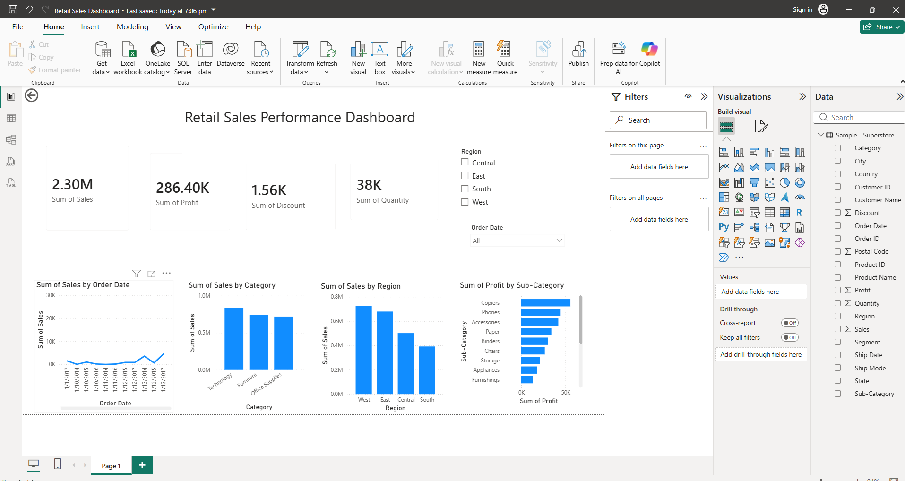

# Retail Sales Performance Dashboard

## 📌 Project Overview
This project is an interactive **Power BI dashboard** built to analyze retail sales performance using the **Superstore Dataset**. It was developed as part of a Data Analytics internship project, focusing on exploratory data analysis, data visualization, and business insight generation.

## 🎯 Objective
To analyze sales, profit, and discount data across different categories, regions, and time periods, and identify key business insights such as top-performing categories, regional performance, and profitability concerns.

## 📂 Dataset
- **Source**: [Superstore Dataset on Kaggle](https://www.kaggle.com/datasets/vivek468/superstore-dataset-final)
- **Format**: CSV (single file)
- **Rows**: ~9,800
- **Columns**: 21 (Order Date, Ship Date, Category, Sub-Category, Region, Sales, Profit, Quantity, Discount, etc.)

## 🛠️ Tools Used
- **Power BI Desktop** – for data cleaning (Power Query), modeling, and dashboard creation
- **Power Query** – for data transformation and cleaning

## 🔧 Process

### 1. Data Cleaning
- Removed unnecessary columns (Row ID, Postal Code)
- Verified and corrected data types (Order Date as Date, Sales/Profit/Discount as Decimal Number, Quantity as Whole Number)
- Checked for missing values and duplicates

### 2. Dashboard Components
- **KPI Cards**: Total Sales, Total Profit, Total Quantity, Total Discount
- **Line Chart**: Sales trend over time (Order Date)
- **Column Chart**: Sales by Category (Technology, Furniture, Office Supplies)
- **Column Chart**: Sales by Region (West, East, Central, South)
- **Bar Chart**: Profit by Sub-Category (highlighting profitable vs loss-making sub-categories)

### 3. Interactivity
- **Region Slicer**: Filter dashboard by Central, East, South, West
- **Order Date Slicer**: Filter dashboard by date (dropdown style)

## 📊 Key Insights

1. **Sales Trend**: Sales remained relatively stable over the time period, with a noticeable spike toward late 2017.
2. **Category Performance**: Technology generates the highest sales, closely followed by Furniture and Office Supplies — all three categories are fairly balanced contributors to total revenue.
3. **Regional Performance**: The West region leads in sales, followed by East, Central, and South. South is the weakest-performing region.
4. **Profitability Concern**: Certain sub-categories (e.g., Tables) show negative or low profit despite decent sales — likely driven by high discount rates. This suggests a need to review the discount strategy on these items.

## 📈 Dashboard Preview



*(Add your dashboard screenshot to the repo and update the path above)*

## 💡 Recommendations
- Review and optimize discount policies for loss-making sub-categories like Tables and Bookcases.
- Investigate the late-2017 sales spike to identify successful drivers (promotions, seasonality) and replicate them.
- Allocate more marketing/resources to the South region to boost its sales performance.

## 📁 Repository Structure
```
├── README.md
├── Retail Sales Dashboard.pbix
├── dashboard_screenshot.png
└── Sample - Superstore.csv
```

## 🚀 How to Use
1. Clone this repository
2. Open `Retail Sales Dashboard.pbix` in Power BI Desktop
3. Refresh data if needed (Home → Refresh)
4. Use the Region and Order Date slicers to explore the data interactively


Manasa Devi yadlapalli – Data Analytics Intern
